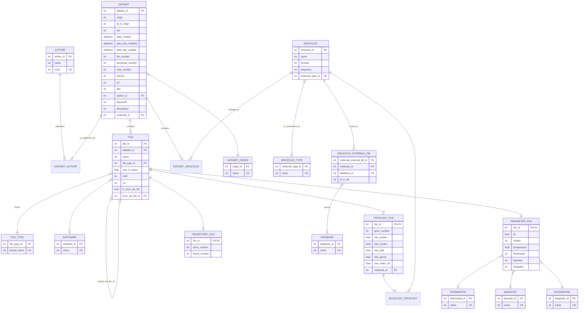

# md_data_schema

```mermaid
    erDiagram
        AUTHOR ||--|{ DATASET_AUTHOR : publishes
        
        DATASET ||--|{ FILE : contains
        DATASET ||--|{ DATASET_AUTHOR : is_published_by
        DATASET ||--o{ DATASET_MOLECULE : contains
        DATASET }|--|| DATASET_ORIGIN : ""

        FILE }|--o| FILE : parent_zip_file_id
        FILE }|--|| FILE_TYPE : found
        FILE }|--o| SOFTWARE : ""
        FILE ||--o| TOPOLOGY_FILE : ""
        FILE ||--o| PARAMETER_FILE : ""
        FILE ||--o| TRAJECTORY_FILE : ""

        TOPOLOGY_FILE ||--|{ MOLECULE_TOPOLOGY : ""
        
        PARAMETER_FILE }|--o| THERMOSTAT : ""
        PARAMETER_FILE }|--o| BAROSTAT : ""
        PARAMETER_FILE }|--|| INTEGRATOR : ""

        MOLECULE ||--|{ MOLECULE_TOPOLOGY : ""
        MOLECULE ||--|{ DATASET_MOLECULE : belongs_to
        MOLECULE }|--o| MOLECULE_TYPE : is_considered_as
        MOLECULE ||--o{ MOLECULE_EXTERNAL_DB : found_in

        MOLECULE_EXTERNAL_DB }|--o| DATABASE : source

        

        AUTHOR {
            int author_id PK
            str name
            int orcid UK
        }

        DATASET {
            int dataset_id PK
            str origin
            str id_in_origin
            str doi
            datetime date_created
            datetime date_last_modified
            datetime date_last_crawled
            int file_number
            int download_number
            int view_number
            str license
            str url
            str title
            int author_id FK
            str keywords
            str description
            int molecule_id FK
        }

        FILE {
            int file_id PK
            int dataset_id FK
            str name
            int file_type_id FK
            float size_in_bytes
            str md5
            str url
            bool is_from_zip_file
            int from_zip_file_id FK
        }

        TOPOLOGY_FILE {
            int file_id PK, FK
            int atom_number
            bool has_protein
            bool has_nucleic
            bool has_lipid
            bool has_glucid
            bool has_water_ion
            int molecule_id FK
        }
        PARAMETER_FILE {
            int file_id PK, FK
            float dt
            int nsteps
            float temperature
            str thermostat
            str barostat
            str integrator
        }
        TRAJECTORY_FILE {
            int file_id PK, FK
            int atom_number
            int frame_number
        }

        MOLECULE {
            int molecule_id PK
            str name
            str formula
            str sequence
            int molecule_type_id FK
        }

        MOLECULE_EXTERNAL_DB {
            int molecule_external_db_id PK
            int molecule_id FK
            int database_id FK
            str id_in_db
        }

        DATASET_ORIGIN {
            int origin_id PK
            str name UK
        }

        DATABASE {
            int database_id PK
            str name UK
        }

        SOFTWARE {
            int software_id PK
            str name UK
        }
        FILE_TYPE {
            int file_type_id PK
            str format_name UK
        }

        MOLECULE_TYPE {
            int molecule_type_id PK
            str name UK
        }

        BAROSTAT {
            int barostat_id PK
            str name UK
        }
        THERMOSTAT {
            int thermostat_id PK
            str name UK
        }
        INTEGRATOR {
            int integrator_id PK
            str name UK
        }
```
