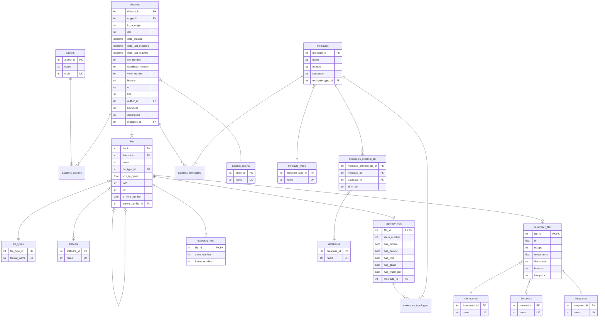

```mermaid
    erDiagram
        authors ||--|{ datasets_authors : ""
        datasets ||--|{ files : ""
        datasets ||--|{ datasets_authors : ""
        datasets ||--o{ datasets_molecules : ""
        datasets }|--|| dataset_origins : ""
        files }|--o| files : ""
        files }|--|| file_types : ""
        files }|--o| software : ""
        files ||--o| topology_files : ""
        files ||--o| parameter_files : ""
        files ||--o| trajectory_files : ""
        topology_files ||--|{ molecules_topologies : ""
        parameter_files }|--o| thermostats : ""
        parameter_files }|--o| barostats : ""
        parameter_files }|--|| integrators : ""
        molecules ||--|{ molecules_topologies : ""
        molecules ||--|{ datasets_molecules : ""
        molecules }|--o| molecule_types : ""
        molecules ||--o{ molecules_external_db : ""
        molecules_external_db }|--o| databases : ""

        authors {
            int author_id PK
            str name
            int orcid UK
        }
        datasets {
            int dataset_id PK
            int origin_id FK
            str id_in_origin
            str doi
            datetime date_created
            datetime date_last_modified
            datetime date_last_crawled
            int file_number
            int download_number
            int view_number
            str license
            str url
            str title
            int author_id FK
            str keywords
            str description
            int molecule_id FK
        }
        files {
            int file_id PK
            int dataset_id FK
            str name
            int file_type_id FK
            float size_in_bytes
            str md5
            str url
            bool is_from_zip_file
            int parent_zip_file_id FK
        }
        topology_files {
            int file_id PK, FK
            int atom_number
            bool has_protein
            bool has_nucleic
            bool has_lipid
            bool has_glucid
            bool has_water_ion
            int molecule_id FK
        }
        parameter_files {
            int file_id PK, FK
            float dt
            int nsteps
            float temperature
            str thermostat
            str barostat
            str integrator
        }
        trajectory_files {
            int file_id PK, FK
            int atom_number
            int frame_number
        }
        molecules {
            int molecule_id PK
            str name
            str formula
            str sequence
            int molecule_type_id FK
        }
        molecules_external_db {
            int molecule_external_db_id PK
            int molecule_id FK
            int database_id FK
            str id_in_db
        }
        dataset_origins {
            int origin_id PK
            str name UK
        }
        databases {
            int database_id PK
            str name UK
        }
        software {
            int software_id PK
            str name UK
        }
        file_types {
            int file_type_id PK
            str format_name UK
        }
        molecule_types {
            int molecule_type_id PK
            str name UK
        }
        barostats {
            int barostat_id PK
            str name UK
        }
        thermostats {
            int thermostat_id PK
            str name UK
        }
        integrators {
            int integrator_id PK
            str name UK
        }
```